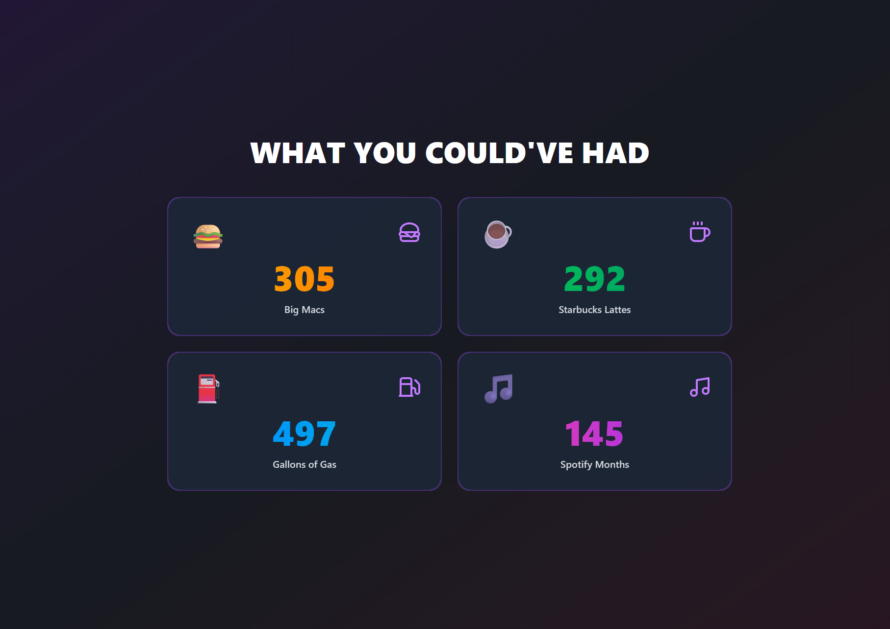

# Steam Shame Recap 💀

> A sarcastic web app that analyzes your Steam library to calculate how much money you wasted on unplayed games.

[](https://react.dev/)
[](https://www.typescriptlang.org/)
[](https://nodejs.org/)
[](https://tailwindcss.com/)
[](LICENSE)

---

## 📸 Demo



> **Live Demo:** _(Coming Soon)_

---

## ✨ Features

### 🔥 **Roast My Wallet**

Analyzes your Steam library and calculates how much money you've wasted on games with less than 2 hours of playtime. Prepare for brutal honesty.

### 🍔 **Opportunity Cost Conversions**

See what you could've had instead:

- **Big Macs** 🍔
- **Starbucks Lattes** ☕
- **Gallons of Gas** ⛽
- **Spotify Premium Months** 🎵

### 📉 **Interactive Full-Page Scroll**

Spotify Wrapped-style storytelling with:

- Smooth scroll snapping
- Framer Motion stagger effects
- Animated number counters
- Typing effect roasts

### 🎨 **Cyberpunk Aesthetic**

- Glassmorphism UI components
- Neon purple/pink gradients
- Drop shadows and glows
- Dark mode optimized

---

## 🚀 Tech Stack

### **Frontend**

- [React 19](https://react.dev/) - Modern React with hooks
- [TypeScript](https://www.typescriptlang.org/) - Type safety
- [Vite](https://vitejs.dev/) - Lightning-fast build tool
- [Tailwind CSS v4](https://tailwindcss.com/) - Utility-first styling
- [Framer Motion](https://www.framer.com/motion/) - Advanced animations

### **Backend**

- [Node.js](https://nodejs.org/) - JavaScript runtime
- [Express](https://expressjs.com/) - REST API framework
- [Axios](https://axios-http.com/) - HTTP client for Steam API

### **Data Source**

- [Steam Web API](https://steamcommunity.com/dev) - Game library data

---

## 📦 Installation

### Prerequisites

- Node.js 18+ and npm
- Steam API Key ([Get one here](https://steamcommunity.com/dev/apikey))

### 1️⃣ Clone the Repository

```bash
git clone https://github.com/AhmetFarukDemir/steam-shame-recap.git
cd steam-shame-recap
```

### 2️⃣ Install Dependencies

This is a monorepo project with separate client and server folders.

```bash
# Install server dependencies
cd server
npm install

# Install client dependencies
cd ../client
npm install
```

### 3️⃣ Configure Environment Variables

Create a `.env` file in the `server/` directory:

```bash
cd server
cp .env.example .env
```

Edit `.env` and add your Steam API key:

```env
STEAM_API_KEY=your_steam_api_key_here
PORT=3001
```

> **How to get a Steam API Key:**
>
> 1. Visit [Steam Web API Registration](https://steamcommunity.com/dev/apikey)
> 2. Login with your Steam account
> 3. Register your domain (use `localhost` for development)
> 4. Copy the generated API key

---

## 🏃 Running the App

### **Development Mode**

You'll need **two terminal windows**:

#### Terminal 1️⃣: Start Backend Server

```bash
cd server
npm run dev
```

Server runs on `http://localhost:3001`

#### Terminal 2️⃣: Start Frontend Dev Server

```bash
cd client
npm run dev
```

Frontend runs on `http://localhost:5173`

### **Using the App**

1. Open `http://localhost:5173` in your browser
2. Enter your **Steam ID** (17-digit SteamID64)
3. Make sure your Steam profile is **public**
4. Click "ROAST MY WALLET 🔥"
5. Get roasted. 💀

> **Finding your Steam ID:**  
> Use [SteamID.io](https://steamid.io/) or check your Steam profile URL

---

## 🎯 How It Works

### **Data Flow**

1. **User Input:** Enter Steam ID on landing page
2. **API Request:** Frontend calls `/api/shame/:steamId`
3. **Steam API Integration:** Backend fetches:
   - User profile (avatar, name)
   - Owned games list with playtime
4. **Calculation Logic:**
   - Filter games with < 2 hours playtime
   - Estimate wasted money (avg $15/game)
   - Convert to real-world items
5. **Roast Generation:** Random sarcastic message
6. **UI Rendering:** Animated scroll presentation

### **API Endpoints**

| Method | Endpoint              | Description        |
| ------ | --------------------- | ------------------ |
| `GET`  | `/api/health`         | Health check       |
| `GET`  | `/api/shame/:steamId` | Get shame analysis |

---

## 📁 Project Structure

```
steam-shame-recap/
├── client/                 # React Frontend
│   ├── src/
│   │   ├── components/    # React components
│   │   │   ├── Landing.tsx
│   │   │   ├── Loading.tsx
│   │   │   └── ShameRecap.tsx
│   │   ├── services/      # API client
│   │   │   └── api.ts
│   │   ├── types.ts       # TypeScript types
│   │   ├── App.tsx        # Main app component
│   │   └── index.css      # Global styles
│   ├── package.json
│   └── vite.config.ts
│
├── server/                # Node.js Backend
│   ├── controllers/       # Route handlers
│   │   └── shameController.js
│   ├── services/          # Steam API integration
│   │   └── steamService.js
│   ├── utils/             # Helper functions
│   │   └── calculations.js
│   ├── index.js           # Express server
│   ├── package.json
│   └── .env.example
│
└── README.md
```

---

## 🎨 UI Highlights

### **Slide 1: Intro**

- User avatar with glow effect
- Typing effect for roast message
- No spoiler numbers (mystery approach)

### **Slide 2: Financial Damage**

- Animated money counter (0 → final amount)
- Neon red/orange gradient
- Dramatic reveal

### **Slide 3: Conversions Grid**

- 2x2 responsive grid
- Staggered entrance animations
- Hover scale effects

### **Slide 4: Wall of Shame**

- Scrollable game cards
- First 40 games displayed
- Playtime badges on hover

---

## 🛠️ Future Enhancements

- [ ] Export results as shareable image
- [ ] Support for multiple currencies
- [ ] Wishlist price tracking
- [ ] Historical comparison ("Last year vs this year")
- [ ] Social sharing (Twitter, Discord)
- [ ] Dark/Light theme toggle

---

## 🤝 Contributing

Contributions are welcome! Feel free to:

1. Fork the repository
2. Create a feature branch (`git checkout -b feature/AmazingFeature`)
3. Commit your changes (`git commit -m 'Add some AmazingFeature'`)
4. Push to the branch (`git push origin feature/AmazingFeature`)
5. Open a Pull Request

---

## 📝 License

This project is licensed under the **MIT License** - see the [LICENSE](LICENSE) file for details.

---

## 🙏 Acknowledgments

- Steam Web API for game data
- Framer Motion for animation inspiration
- Spotify Wrapped for UI/UX concept
- Every gamer with a massive backlog 💀

---

<div align="center">

**Made with 💀 and a little bit of shame**

</div>
